# Government Fund Allocation and Tracking System


## Introduction
Blockchain technology has revolutionized various industries by offering data integrity, decentralization, and transparency. In this project, we leverage blockchain to manage and allocate government funds, ensuring transparency and security.

## Problem Statement
In the current system, fund allocations are displayed on government portals without detailed tracking of how funds are used, leading to potential corruption. Our platform aims to solve this problem by using blockchain to provide a transparent and secure fund management system.

## Proposed System


|  | We have developed a decentralized platform that allows the government to allocate and track funds. This platform ensures security and transparency throughout the fund distribution process. |
|:---:|---|

### Built On
- **Public Blockchain:** Ethereum  
- **Decentralized Distributed Storage:** IPFS  

## Technology Stack
### Libraries
- **React:** Front-end web development 


### Frameworks
- **Hardhat:** Development environment for Ethereum software  
          
- **Alchemy:** Ethereum node provider  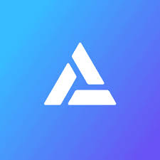
- **MetaMask Wallet:** Ethereum wallet for storing, buying, sending, and transferring cryptocurrency  
- **Ether:** Native cryptocurrency for transaction fees and computational services 

### Flow in the Platform
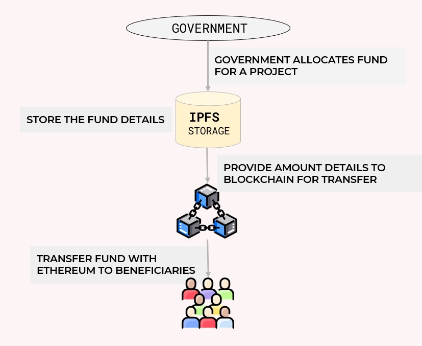

1. **Government Allocates Fund**
    - The government allocates funds to various projects.
2. **Store Fund Details in IPFS**
    - Fund details are stored in IPFS for immutability.
3. **Transfer Fund via Ethereum to Beneficiaries**
    - Funds are transferred to beneficiaries using Ethereum smart contracts.


## Architecture

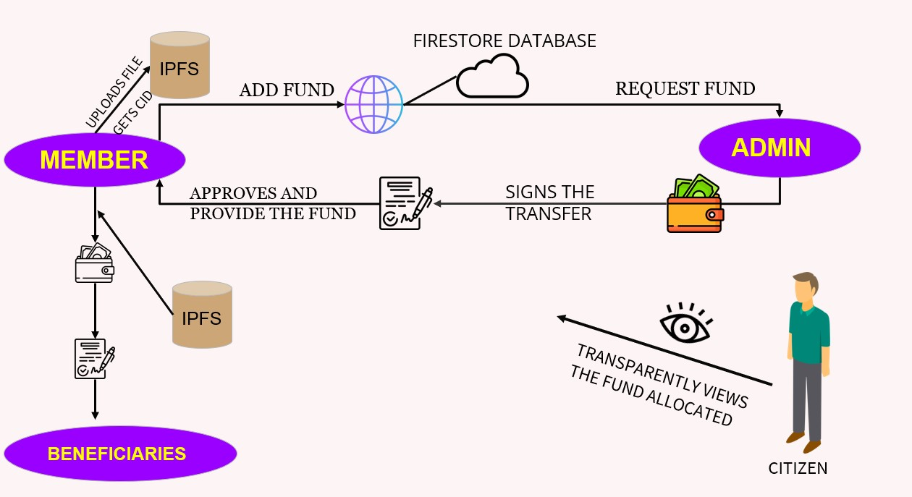

### Types of Users
- **Admin:** Accepts member requests and provides funds
- **Member:** Allocates funds and adds fund details, generating a CID in IPFS

## Login and Registration
Admin and members register and login using a Unique ID [UID]

## Data Storage
- **IPFS:** Stores sensitive information immutably  
- **Firestore Database:** Stores mutable parts of the data   
          

  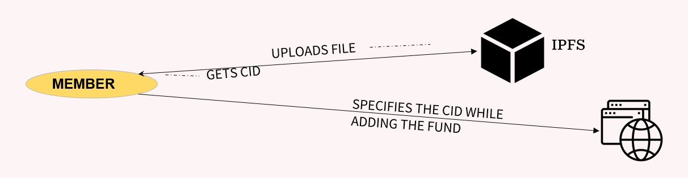

## Transaction Process
- Real Ether is transferred to beneficiaries using Ethereum smart contracts.
- Digital signatures using ECDSA (Elliptical Curve Digital Signature Algorithm) ensure transaction security.

## Tracking and Public View
- Members can track transactions.
- Fund details are publicly displayed on the homepage for transparency.

## Limitations
- Offline procedures such as budget planning, choosing beneficiaries, and data collection are not included.
- The platform does not provide regulatory policies.

## Fund Types and Flow
### Diagram of Various Funds


### Screenshots
1. **Home Page**
   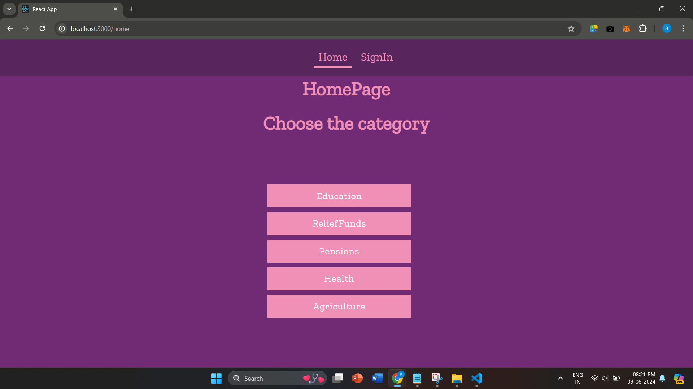

2. **Member login**
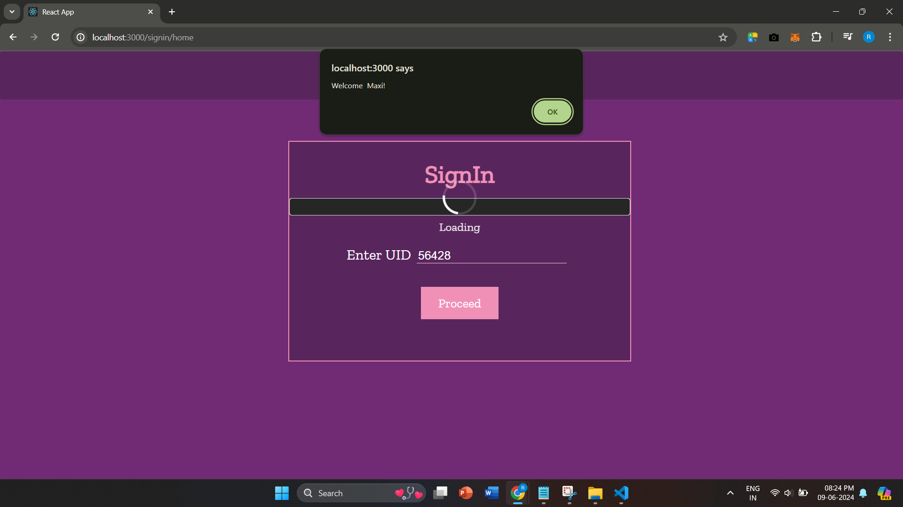
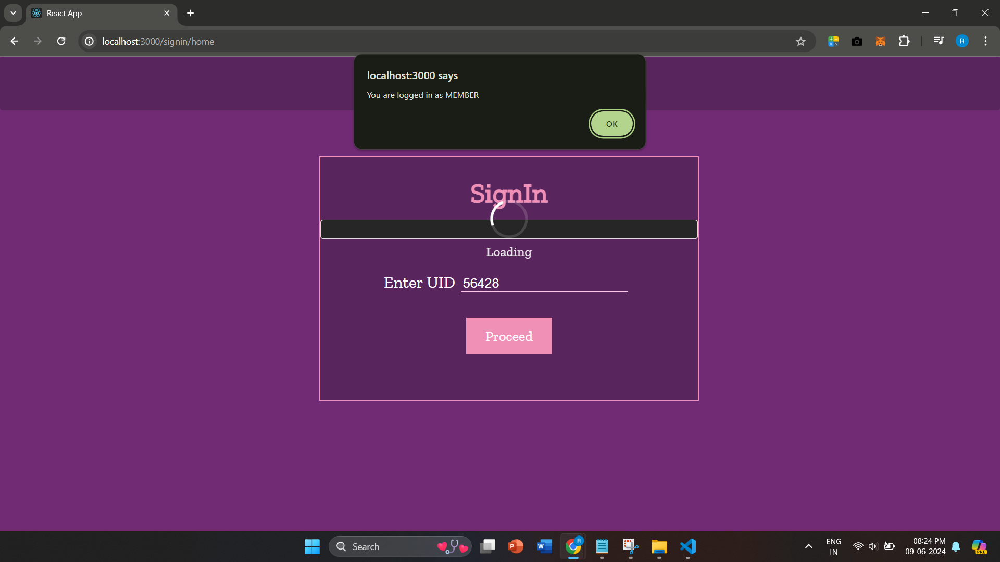


3. **Member Dashboard**
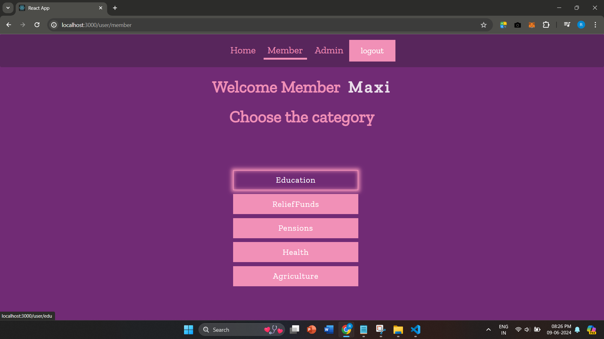

4. **Add Funds**
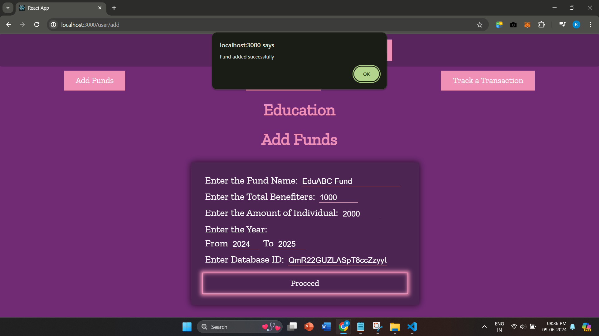

**After adding fund:**

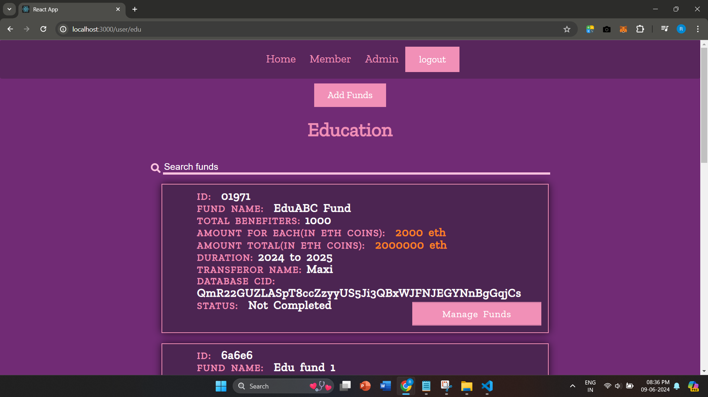

5. **Admin Login**
   
  
    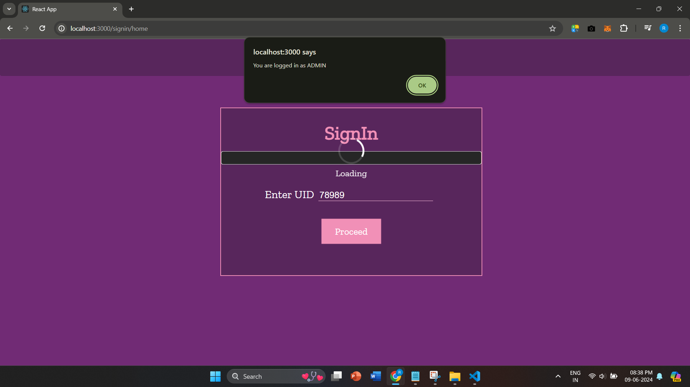

6. **Admin Dashboard**
 
  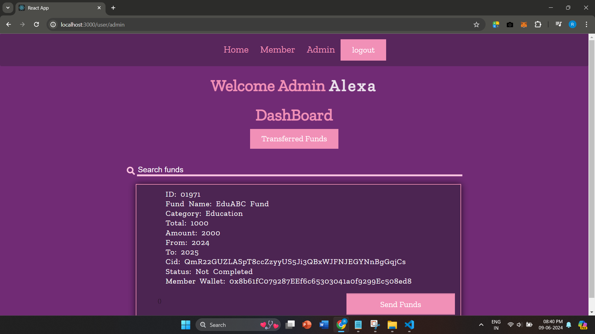

  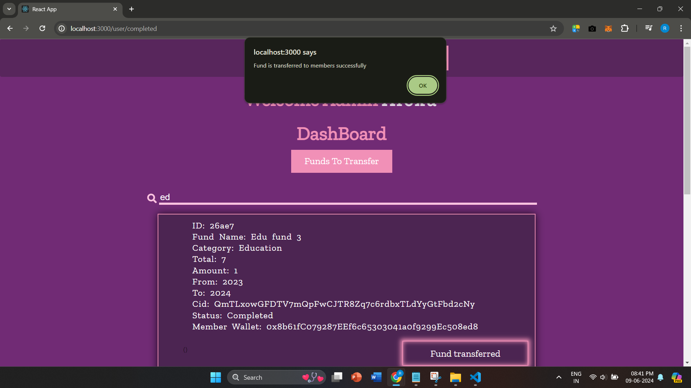
  

7. **Transaction Tracking Page**
   
   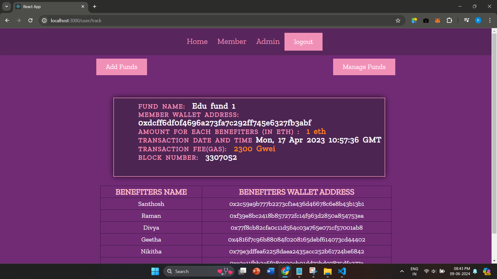

## Conclusion
Our blockchain-based platform offers a secure and transparent solution for government fund allocation and tracking, aiming to reduce corruption and improve accountability.


## How to Run the Project

### Prerequisites
- Node.js and npm
- MetaMask Wallet
- Ethereum Test Network (e.g., Rinkeby)
- Alchemy Account

## Team Members
- Ragave I.
- Varshini R.
- Keerthana B.
- Priyangaa P.K.

  
### Installation
1. **Clone the repository:**
   ```bash
   git clone https://github.com/yourusername/your-repo-name.git
   cd your-repo-name


# Getting Started with Create React App

This project was bootstrapped with [Create React App](https://github.com/facebook/create-react-app).

## Available Scripts

In the project directory, you can run:

### `npm start`

Runs the app in the development mode.\
Open [http://localhost:3000](http://localhost:3000) to view it in your browser.

The page will reload when you make changes.\
You may also see any lint errors in the console.

### `npm test`

Launches the test runner in the interactive watch mode.\
See the section about [running tests](https://facebook.github.io/create-react-app/docs/running-tests) for more information.

### `npm run build`

Builds the app for production to the `build` folder.\
It correctly bundles React in production mode and optimizes the build for the best performance.

The build is minified and the filenames include the hashes.\
Your app is ready to be deployed!

See the section about [deployment](https://facebook.github.io/create-react-app/docs/deployment) for more information.

### `npm run eject`

**Note: this is a one-way operation. Once you `eject`, you can't go back!**

If you aren't satisfied with the build tool and configuration choices, you can `eject` at any time. This command will remove the single build dependency from your project.

Instead, it will copy all the configuration files and the transitive dependencies (webpack, Babel, ESLint, etc) right into your project so you have full control over them. All of the commands except `eject` will still work, but they will point to the copied scripts so you can tweak them. At this point you're on your own.

You don't have to ever use `eject`. The curated feature set is suitable for small and middle deployments, and you shouldn't feel obligated to use this feature. However we understand that this tool wouldn't be useful if you couldn't customize it when you are ready for it.

## Learn More

You can learn more in the [Create React App documentation](https://facebook.github.io/create-react-app/docs/getting-started).

To learn React, check out the [React documentation](https://reactjs.org/).

### Code Splitting

This section has moved here: [https://facebook.github.io/create-react-app/docs/code-splitting](https://facebook.github.io/create-react-app/docs/code-splitting)

### Analyzing the Bundle Size

This section has moved here: [https://facebook.github.io/create-react-app/docs/analyzing-the-bundle-size](https://facebook.github.io/create-react-app/docs/analyzing-the-bundle-size)

### Making a Progressive Web App

This section has moved here: [https://facebook.github.io/create-react-app/docs/making-a-progressive-web-app](https://facebook.github.io/create-react-app/docs/making-a-progressive-web-app)

### Advanced Configuration

This section has moved here: [https://facebook.github.io/create-react-app/docs/advanced-configuration](https://facebook.github.io/create-react-app/docs/advanced-configuration)

### Deployment

This section has moved here: [https://facebook.github.io/create-react-app/docs/deployment](https://facebook.github.io/create-react-app/docs/deployment)

### `npm run build` fails to minify

This section has moved here: [https://facebook.github.io/create-react-app/docs/troubleshooting#npm-run-build-fails-to-minify](https://facebook.github.io/create-react-app/docs/troubleshooting#npm-run-build-fails-to-minify)
